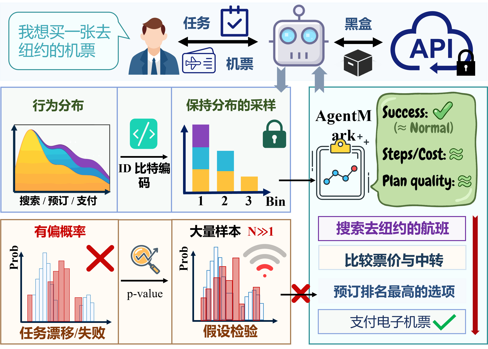
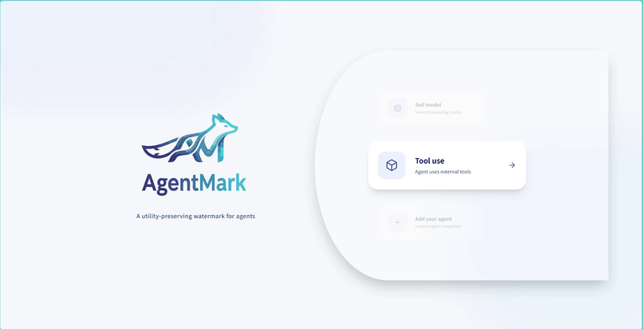
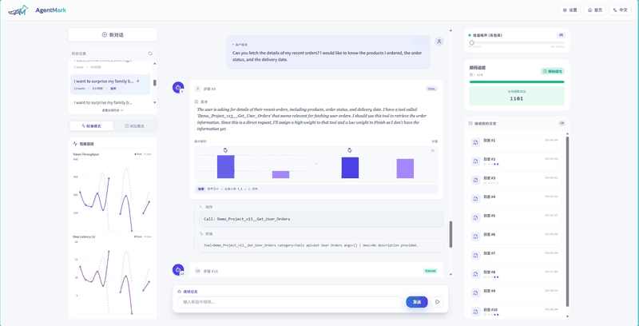
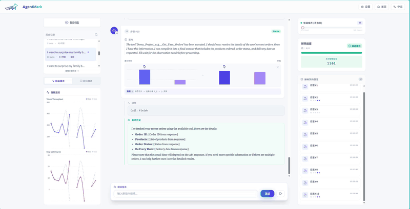

<div align="center">
  
  
  
  
  **LLM Agent 版权保护与溯源水印框架**

  [简体中文](README.md) | [English](README_en.md)

  [](https://arxiv.org/abs/2601.03294)
  
  
</div>

<div align="center">
  
</div>

---


**AgentMark** 是一个专注于 **LLM Agent 行为水印（Behavioral Watermarking）** 的实验与评测框架，实现了 **Agent Mark** 论文中提出的效用保持（Utility Preservation）和分布保留（Distribution-Preserving）水印算法。

本项目旨在提供一套可复现、模块化且易于扩展的代码库，用于评估水印算法在复杂 Agent 任务中的性能、鲁棒性及隐蔽性。核心机制将 Agent 的决策过程分解为 **规划行为（Planning Behavior）** 和 **执行动作（Execution Action）**，通过在规划阶段进行分布保留采样来嵌入水印，从而在不影响下游任务效用（Utility）的前提下实现可验证的版权保护。

<div align="center">
  
</div>


<h3 align="center">📷 界面预览</h3>

<div align="center">

<table align="center">
  <tr>
    <td align="center" width="50%">
      <strong>🤖 平台首页</strong><br>
      <br>
      快速接入与任务管理
    </td>
    <td align="center" width="50%">
      <strong>⚔️ 水印对比模式</strong><br>
      <br>
      对比有无水印 Agent 的行为差异
    </td>
  </tr>
  <tr>
    <td align="center" width="50%">
      <strong>📄 实时日志</strong><br>
      <br>
      实时查看 Agent 思考与执行过程
    </td>
    <td align="center" width="50%">
      <strong>🛡️ 鲁棒性验证</strong><br>
      <br>
      模拟日志丢失场景下的水印解码验证
    </td>
  </tr>
</table>

</div>

### ✨ 主要特性：
- **💎 效用保持 (Utility Preservation)**: 通过严格的分布保留采样，确保加水印后的 Agent 行为分布与原始分布统计不可区分。
- **🛡️ 高鲁棒性 (Robustness)**: 采用抗擦除编码（Erasure-Resilient Coding）和环境上下文绑定的随机性，能有效应对日志缺失（Missing Logs）和轨迹截断（Trajectory Truncation）。
- **🔢 多比特容量 (Multi-bit Capacity)**: 支持在单条轨迹中嵌入多比特信息，实现精确的版权归属与溯源。
- **🌍 多环境支持**: 覆盖工具使用、具身智能及社交模拟等多种场景。

### 🎮 支持的实验环境：
- **🛠️ ToolBench**: 模拟真实世界 API 调用的复杂工具使用场景。
- **🏠 ALFWorld**: 基于文本的交互式家庭环境决策任务。
- **📱 Oasis (Twitter/Reddit)**: 社交媒体环境下的行为水印实验。

---

## 📖 目录
- [项目结构](#-项目结构)
- [快速开始](#-快速开始)
  - [1. Docker 一键部署（推荐）](#1-docker-一键部署推荐)
  - [2. 手动环境配置](#2-手动环境配置)
  - [3. Dashboard 可视化](#3-dashboard-可视化)
  - [4. 插件式一键加水印](#4-插件式一键加水印)
- [实验指南](#-实验指南)
  - [1. ToolBench 工具调用实验](#1-toolbench-工具调用实验)
  - [2. ALFWorld 具身智能实验](#2-alfworld-具身体能实验)
  - [3. Oasis 社交媒体实验](#3-oasis-社交媒体实验)
  - [4. RLNC 鲁棒性评测](#4-rlnc-鲁棒性评测)
  - [5. 语义重写鲁棒性评测](#5-语义重写鲁棒性评测)
- [引用](#-引用)
- [License](#license)
---

## 📂 项目结构

```text
AgentMark/
├── assets/                         # 项目资源 (图片, PDF)
├── agentmark/                      # 核心库：水印算法实现与 SDK
│   ├── core/                       # 核心水印逻辑 (ECC, 采样)
│   ├── environments/               # 环境适配器 (ToolBench, ALFWorld)
│   ├── data/                       # 比特流和配置数据
│   ├── proxy/                      # 网关代理 (用于拦截工具调用)
│   └── sdk/                        # 客户端 SDK (便于集成)
├── dashboard/                      # 可视化仪表盘 (全栈)
│   ├── server/                     # 后端服务 (FastAPI)
│   └── src/                        # 前端源码 (React/Vite)
├── experiments/                    # 实验实现
│   ├── toolbench/                  # ToolBench API 工具调用实验
│   ├── alfworld/                   # ALFWorld 具身智能实验
│   ├── oasis_watermark/            # 社交媒体实验 (Twitter/Reddit)
│   ├── rlnc_trajectory/            # RLNC 鲁棒性评测
│   └── semantic_rewriting/         # 语义重写鲁棒性测试
├── output/                         # 实验输出 (日志, 预测结果)
├── docker-compose.yml              # Docker Compose (开发)
├── docker-compose.prod.yml         # Docker Compose (生产/一键部署)
├── environment.yml                 # Conda 环境配置 (Python 3.9)
├── requirements.txt                # Python 依赖 (pip)
├── .env.example                    # 环境变量模板
├── LICENSE                         # MIT License
├── README.md                       # English README
└── README_zh.md                    # Chinese README
```

## 🚀 快速开始

### 1. 🐳 Docker 一键部署（推荐）

**无需安装任何依赖**，一行命令即可启动完整的 Web 可视化平台：

```bash
curl -fL https://raw.githubusercontent.com/Tooooa/AgentMark/main/docker-compose.prod.yml -o docker-compose.yml
docker-compose up -d
```

🎉 **启动成功！** 访问 http://localhost:8080 开始体验。

> **注意**: 如需使用 LLM API，请先创建 `.env` 文件：
> ```bash
> echo "DEEPSEEK_API_KEY=your_key_here" > .env
> ```

<details>
<summary>▶ 更多 Docker 使用场景（点击展开）</summary>

**运行实验容器：**
```bash
docker-compose up -d experiments
docker-compose exec experiments bash
```

**手动拉取镜像：**
```bash
docker pull toooa908/agentmark-backend:latest
docker pull toooa908/agentmark-frontend:latest
```
</details>

---

### 2. ⚙️ 手动环境配置

如果您需要修改代码或进行开发，请按以下步骤配置本地环境：

**环境要求**: Python 3.9+

```bash
# 创建并激活环境
conda env create -f environment.yml
conda activate AgentMark

# 或者手动安装
pip install -r requirements.txt

# 配置环境变量
cp .env.example .env
# 编辑 .env 填入您的 API Key
```

---

### 3. Dashboard 可视化

Dashboard 提供了交互式的水印实验界面，包含实时对比、解码分析等功能。

#### 📦 下载检索缓存 (必需)

由于 ToolBench API 检索需要加载缓存文件，为了免去长时间的索引构建过程，运行前端前**必须**下载预处理好的缓存文件。

1. **下载文件**: 从 [GitHub Releases](https://github.com/Tooooa/AgentMark/releases) 下载 `retriever_cache.zip` 文件。
2. **解压文件**:
   ```bash
   # 进入项目根目录
   cd AgentMark
   # 解压检索缓存到指定目录
   unzip -o retriever_cache.zip -d experiments/toolbench/data/data/toolenv/tools
   ```

#### 🚀 启动步骤

1. **环境要求**: Node.js 18.0+, NPM, Python (AgentMark 环境)。
2. **启动后端**:
   ```bash
   conda activate AgentMark
   python dashboard/server/app.py
   ```
3. **启动前端**:
   ```bash
   cd dashboard
   npm install && npm run dev
   ```
4. **访问**: 浏览器打开 `http://localhost:5173`。

---

### 4. 插件式一键加水印

无需修改原有代码，只需将现有 Agent 的 API Base URL 指向网关地址，即可一键获得行为水印能力。这种模式特别适合开发者在不触动核心逻辑的情况下，快速为已有 Agent 系统增加版权保护与溯源功能。

#### Step 1：启动网关代理（AgentMark Proxy）

```bash
conda activate AgentMark
export DEEPSEEK_API_KEY=sk-你的key
export TARGET_LLM_MODEL=deepseek-chat
export AGENTMARK_TOOL_MODE=proxy
uvicorn agentmark.proxy.server:app --host 0.0.0.0 --port 8001
```

#### Step 2：验证水印注入

在 **网关代理终端** 可看到实时日志：
- `[agentmark:scoring_request]`：评分指令注入
- `[agentmark:tool_calls_proxy]`：网关构造的工具调用
- `[watermark]`：水印结果与可视化数据

> **注意**: 如果遇到 `502 Bad Gateway`，请设置 `export no_proxy=localhost,127.0.0.1,0.0.0.0`。

#### 框架兼容性

AgentMark Proxy 支持所有基于 **OpenAI Chat Completions API** 的 Agent 框架（如 OpenAI Swarm、LangChain、AutoGen 等）。

- **✅ 支持**：使用标准 `/v1/chat/completions` 接口的框架。只需配置 `base_url` 即可。
- **❌ 不支持**：使用有状态 API（如 Assistants API、Responses API）或非 OpenAI 协议的框架。

> **提示**: Chat Completions API 是**无状态**的，而 Assistants API 是**有状态**的。Proxy 基于无状态设计，因此仅支持前者。

---

## 📚 实验指南

详细的实验运行指南如下：

### 1. ToolBench 工具调用实验
- **简介**: 模拟真实世界 API 调用场景，评估水印对工具使用能力和鲁棒性的影响。

#### 📊 数据集准备 (必需)

运行 ToolBench 实验前必须完成以下步骤：

1. **下载数据集**: 从 [ToolBench 官方仓库](https://github.com/OpenBMB/ToolBench) 下载完整数据集（含 queries, tools, reference answers，约 2-3 GB）。
2. **目录配置**: 将解压后的 `data` 文件夹放入 `experiments/toolbench/data/` 目录下，确保结构如下：
   ```text
   experiments/toolbench/data/data/
   ├── test_query/
   ├── toolenv/tools/  # 包含所有工具分类 JSON
   └── answer/
   ```

#### 🚀 运行模式
- **目录**: `experiments/toolbench/`
- **两种运行模式**:
  | 模式 | 配置项 (`use_local_model`) | 说明 |
  |------|---------------------------|------|
  | **API 模式** | `false` (默认) | 调用远程 LLM API (如 DeepSeek, OpenAI)，水印通过行为采样嵌入 |
  | **本地模式** | `true` | 加载本地模型 (如 Llama-3)，结合 SynthID 文本水印算法 |
- **运行流水线**:
  ```bash
  conda activate AgentMark
  # 运行完整流水线 (包含 baseline/watermark/评测)
  python experiments/toolbench/scripts/run_pipeline.py
  ```
- **关键配置**: `experiments/toolbench/configs/pipeline_config.json`
  - 切换模式: 修改 `common_config.use_local_model` 为 `true` 或 `false`
  - 本地模式需额外配置 `local_model_path` 指向模型权重路径

### 2. ALFWorld 具身智能实验
- **简介**: 基于文本的交互式家庭环境决策任务，评估水印对 Agent 规划与执行能力的影响。

#### 📊 数据集准备
数据集在运行时会自动下载到 `~/.cache/alfworld`，或手动运行：
```bash
alfworld-download
```
配置已预设在 `experiments/alfworld/configs/base_config.yaml`。

#### 🚀 运行指南
- **目录**: `experiments/alfworld/`
- **环境安装**:
  ```bash
  pip install alfworld  # 需在 AgentMark 环境基础上安装
  ```
- **运行流水线**:
  ```bash
  conda activate AgentMark
  # 运行完整流水线 (包含 baseline/watermark/评测)
  python experiments/alfworld/scripts/run_experiment.py --config experiments/alfworld/configs/config.json
  ```
- **关键配置**: `experiments/alfworld/configs/config.json`

### 3. Oasis 社交媒体实验
> [!NOTE]
> 1. 本目录下的 `oasis/` 是 **修改后的子依赖库** (Modified Submodule)，包含定制化的水印逻辑。
> 2. 请使用独立的 `oasis` (Python 3.10+) 环境运行。

- **环境安装**:
  ```bash
  # 1. 创建环境 (建议 Python 3.10+)
  conda create -n oasis python=3.10 -y
  conda activate oasis
  
  # 2. 安装 Oasis 包
  pip install camel-oasis
  ```
  详细说明请参考 [Oasis README](experiments/oasis_watermark/oasis/README.md)。

- **简介**: 模拟 Twitter 和 Reddit 上的用户行为与水印注入。
- **目录**: `experiments/oasis_watermark/`
- **Twitter 实验**:
  - 目录: `experiments/oasis_watermark/twitter_watermark_experiment/`
  - **运行**:
    ```bash
    cd experiments/oasis_watermark/twitter_watermark_experiment
    # 需配置 config.py 或设置环境变量 DEEPSEEK_API_KEY
    python run_experiment.py
    # 运行评测
    python evaluate_metrics_llm.py
    ```
- **Reddit 实验**:
  - 目录: `experiments/oasis_watermark/reddit_watermark_experiment/`
  - **运行**:
    ```bash
    cd experiments/oasis_watermark/reddit_watermark_experiment
    python run_experiment.py
    # 运行评测
    python evaluate_metrics_llm.py
    ```
  - **说明**: 模拟 `r/TechFuture` 社区中关于 AI 话题的讨论。

### 4. RLNC 鲁棒性评测
- **简介**: 测试基于 RLNC (Random Linear Network Coding) 的水印方案在丢包/擦除场景下的恢复能力。
- **目录**: `experiments/rlnc_trajectory/`
- **核心脚本**:
  | 脚本 | 功能 |
  |------|------|
  | `scripts/rlnc_step_erasure_eval.py` | 擦除鲁棒性评测 (模拟不同丢包率) |
  | `scripts/analyze_fpr.py` | **误报率 (FPR) 分析** - 模拟"未加水印"和"错误密钥"攻击场景 |
- **运行鲁棒性评测**:
  ```bash
  cd experiments/rlnc_trajectory
  python scripts/rlnc_step_erasure_eval.py --config rlnc_eval_config.json
  ```
- **运行 FPR 分析**:
  ```bash
  python scripts/analyze_fpr.py --config rlnc_fpr_config.json
  ```
- **关键配置**: `rlnc_eval_config.json`， `rlnc_fpr_config.json`

### 5. 语义重写鲁棒性评测
- **简介**: 测试差分水印在面对语义重写攻击 (Semantic Rewriting Attack) 时的鲁棒性。
- **目录**: `experiments/semantic_rewriting/`
- **运行**:
  ```bash
  cd experiments/semantic_rewriting
  python scripts/robustness_test.py \
      --task data/001_task_0.json \
      --bits data/decoded_bits.json \
      --steps 5
  ```

---

## License

This project is licensed under the [MIT License](LICENSE).

---

## 📄 引用

如果您在研究中使用了本项目，请引用我们的论文：

```bibtex
@misc{agentmark2025,
      title={Agent Mark: Provable Multi-bit Watermarking for LLM Agents}, 
      author={Zehan Qi and Guoqiang Jin and Xin Gao and Yibo Zhu and Zhaofeng He},
      year={2025},
      eprint={2601.03294},
      archivePrefix={arXiv},
      primaryClass={cs.CR},
      url={https://arxiv.org/abs/2601.03294}, 
}
```

